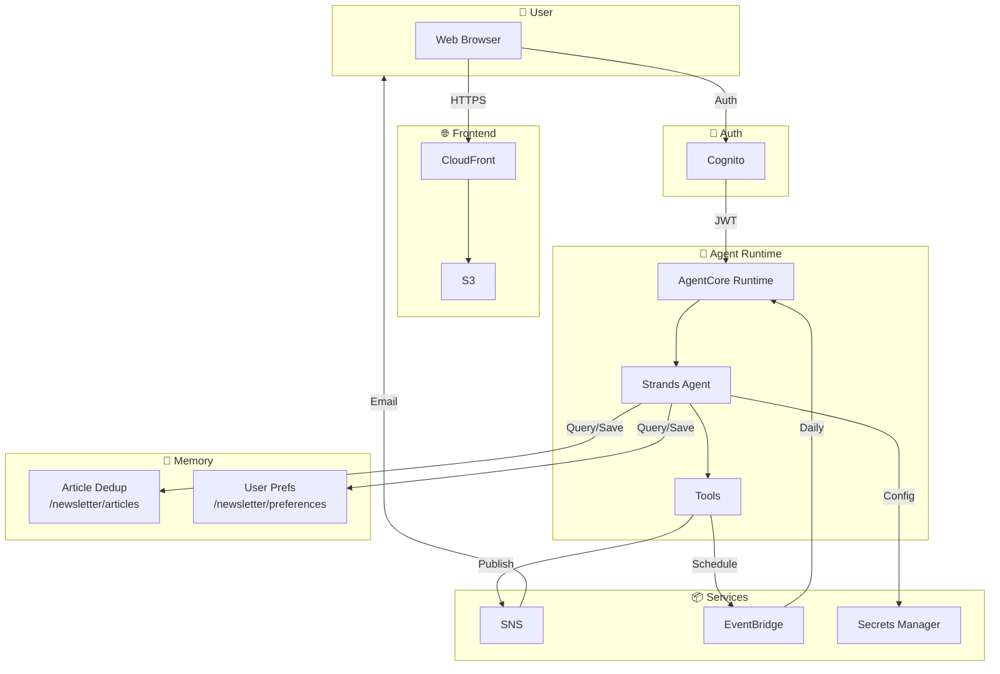

# AWS What's New Alerts

**Autonomous AI newsletter system** that generates and delivers daily email digests about AWS announcements, focused on **Agentic AI** (AgentCore, Strands, MCP, A2A) and AI/ML updates.

Built with AWS Bedrock AgentCore, Strands Agents SDK, and CDK.

## 🎯 Features

- 🤖 **Autonomous Operation** - Self-schedules via EventBridge
- 🎯 **Agentic AI Focus** - Prioritizes AgentCore, Strands, MCP, Kiro, A2A, Claude
- 🧠 **Per-User Memory** - Remembers your name, preferences, and newsletter history
- 📰 **Browse vs Publish** - View news without sending, or publish on demand
- 📧 **Email Delivery** - Professional newsletters via SNS
- 💬 **Web Chat UI** - Real-time streaming with tool visualization
- 🔒 **Secure** - Cognito auth with JWT-based user isolation

## 🏗️ Architecture



### Key Highlights

| Feature | Description |
|---------|-------------|
| **Per-User Memory** | JWT `sub` claim isolates each user's data |
| **Article Deduplication** | Semantic memory prevents duplicate newsletters |
| **Newsletter History** | Tracks when newsletters were sent (with timestamps) |
| **Self-Discovery** | Agent finds its own ARN for scheduling |
| **Direct Streaming** | No API Gateway timeouts |

## 🚀 Quick Start

### Prerequisites
- AWS Account with Bedrock AgentCore access
- Python 3.10+: `source .venv/bin/activate`
- AWS CDK: `npm install -g aws-cdk`
- AgentCore CLI: `pip install bedrock-agentcore-cli`

### One-Command Deployment
```bash
./deploy.sh --email your-email@example.com
```

### Manual Deployment

**1. Deploy Infrastructure**
```bash
cd backend
cdk bootstrap  # First time only
cdk deploy --context email=your-email@example.com
```

**2. Configure Secrets**
```bash
python configure_secret.py --email your-email@example.com
```

**3. Deploy Agent**
```bash
cd ../agent
source agent_config.env
agentcore configure -e agent.py \
  --region $AWS_REGION \
  --name $AGENT_NAME \
  --execution-role $AGENTCORE_RUNTIME_ROLE_ARN
agentcore launch --env SECRET_NAME=$SECRET_NAME --env AWS_REGION=$AWS_REGION
```

**4. Deploy Frontend**
```bash
cd ../backend
python deploy_frontend.py
```

**5. Self-Schedule** (via Chat UI)
> "Schedule yourself for 6am EST daily"

## 💬 Usage Modes

### Browse Mode
Ask about news without sending email:
> "What's new in AWS today?"

Agent shows summary and asks if you want to publish.

### Publish Mode
Explicitly request newsletter:
> "Send me a newsletter"

Agent generates, sends email, and confirms with timestamp.

### Memory Recall
Ask about past activity:
> "What's the most recent newsletter you sent me?"

Agent recalls: "Newsletter sent on November 27, 2025 at 1:15 PM EST..."

## 🧠 Memory System

| Namespace | Purpose |
|-----------|---------|
| `/newsletter/articles/{userId}` | Article URLs for deduplication |
| `/newsletter/preferences/{userId}` | User name, preferences, newsletter history |

**How it works:**
1. `LongTermMemoryHookProvider` retrieves context before each query
2. Agent processes request with full context
3. Hook saves conversation to memory after response
4. 30-day TTL auto-cleans old data

## 📁 Project Structure

```
aws-whats-new-alerts/
├── agent/
│   ├── agent.py              # Main agent
│   ├── memory_hooks.py       # Long-term memory integration
│   ├── secrets_loader.py     # Config loader
│   └── tools/                # Custom tools
├── backend/
│   ├── newsletter_stack.py   # CDK infrastructure
│   ├── configure_secret.py   # Secrets setup
│   └── deploy_frontend.py    # Frontend deployment
├── frontend/
│   ├── index.html            # Chat UI
│   └── vendor/               # Vendored dependencies
└── deploy.sh                 # One-command deploy
```

## 🔧 Configuration

### Content Focus
- **Default**: Agentic AI (AgentCore, Strands, MCP, A2A, Claude) + AI/ML
- **Override**: Say "all announcements" for broader coverage

### Time Frames
- `"last 24 hours"` (default)
- `"yesterday"` / `"last 3 days"` / `"last week"`

## 🔒 Security

- **Cognito**: Email/password with verification
- **JWT Validation**: AgentCore validates tokens
- **Per-User Isolation**: Memory scoped by user ID
- **Least Privilege**: IAM roles scoped to account/region
- **No API Gateway**: Direct streaming reduces attack surface

## 🛠️ Operations

### Update Agent
```bash
cd agent
agentcore launch --env SECRET_NAME=$SECRET_NAME --env AWS_REGION=$AWS_REGION
```

### View Logs
```bash
aws logs tail /aws/bedrock-agentcore/runtimes/ --follow
```

### Destroy
```bash
./destroy.sh
```

## 📄 License

© 2025 Amazon Web Services, Inc.
