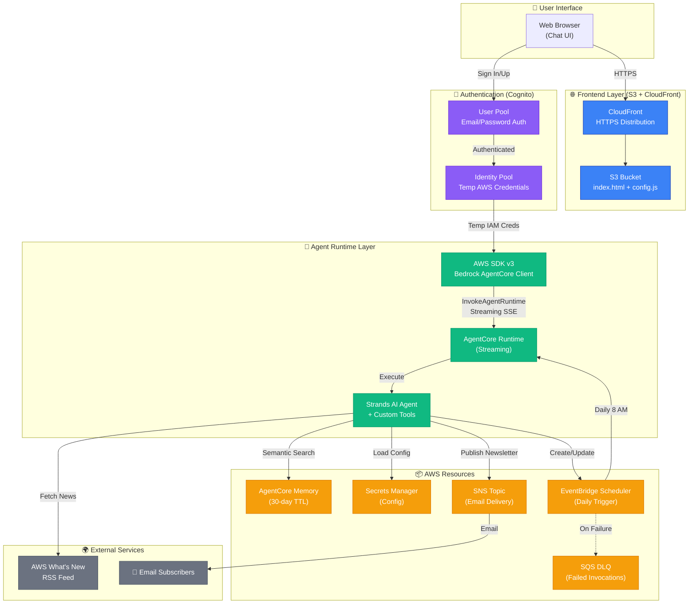

# AWS What's New Alerts

**Fully autonomous AI newsletter system** that generates and delivers daily email digests about AWS announcements, with a focus on AI/ML updates.

Built with AWS Bedrock AgentCore, Strands AI framework, and CDK Infrastructure as Code.

## 🎯 What This Does

- 🤖 **Fully Autonomous** - Runs daily via EventBridge Scheduler
- 🔍 **Smart Filtering** - Focuses on AI/ML announcements (Bedrock, SageMaker, Claude, AgentCore)
- 🧠 **Semantic Memory** - Remembers processed articles, prevents duplicates (30-day expiry)
- 📧 **Professional Formatting** - ASCII-bordered newsletters with ranked announcements
- 📨 **Email Delivery** - Delivers via Amazon SNS to subscribers
- 💬 **Web Chat UI** - Clean, authenticated web interface with **Real-time Streaming** and **Tool Call Visualization**
- 🔒 **Secure Architecture** - Serverless frontend (S3/CloudFront) with direct AWS SDK v3 streaming (No API Gateway timeout)
- 🛡️ **Bank-Grade Security** - Cognito Authentication + Identity Pools for secure, direct agent access

## 🏗️ Architecture

The system uses a modern **Streaming Architecture** to bypass API Gateway timeouts and provide a responsive user experience.



### Key Architecture Highlights

**🔒 Security**
- Cognito authentication with email verification
- IAM least privilege (scoped to account + region)
- No API Gateway or Lambda (eliminates attack surface)
- Temporary credentials via Identity Pool

**⚡ Performance**
- Direct browser → AgentCore streaming (no proxies)
- Real-time token streaming with tool visualization
- No cold starts (no Lambda)
- CloudFront edge caching for frontend assets

**🧠 Intelligence**
- Semantic memory prevents duplicate articles
- Self-discovery pattern (agent finds its own ARN)
- Autonomous scheduling (agent manages EventBridge)
- Tool call transparency (visible in chat UI)

**📧 Delivery**
- SNS email distribution to subscribers
- ASCII-bordered professional newsletters
- AI/ML focused content filtering
- Daily automated execution

## 🚀 Quick Start

### Prerequisites
- AWS Account with Bedrock AgentCore access
- Python 3.10+ in virtual environment: `source .venv/bin/activate`
- AWS CDK CLI: `npm install -g aws-cdk`

### 1. Deploy Infrastructure (5-10 minutes)
```bash
cd backend

# Bootstrap CDK (first time only per account/region)
cdk bootstrap

# Deploy all resources (Backend + Frontend)
cdk deploy --context email=your-email@example.com
# ⏱️ Wait for deployment to complete
```

**Creates:** SNS Topic, AgentCore Memory, IAM roles, Secrets Manager, **Cognito Auth**, and **CloudFront/S3 Hosting**.

### 2. Configure Agent Secrets
Push configuration securely to AWS Secrets Manager and generate local deployment config:

```bash
python configure_secret.py --email your-email@example.com
```

**This script does two things:**
1. ✅ **Updates Secrets Manager** - Pushes runtime config (SNS ARN, Memory ID, etc.) for the agent to load at runtime
2. ✅ **Generates `agent/agent_config.env`** - Creates local file with `AGENTCORE_RUNTIME_ROLE_ARN` and `AGENT_NAME` for `agentcore configure` command

```
configure_secret.py Flow:
┌─────────────────────────────────────────────────────────────┐
│  1. Read CloudFormation Stack Outputs                       │
│     (SNS ARN, Memory ID, Role ARN, etc.)                    │
└────────────────────────┬────────────────────────────────────┘
                         │
                         ├──────────────────┬─────────────────
                         ▼                  ▼
         ┌───────────────────────┐  ┌──────────────────────┐
         │  AWS Secrets Manager  │  │  agent_config.env    │
         │  (Runtime Config)     │  │  (Deployment Config) │
         └───────────┬───────────┘  └──────────┬───────────┘
                     │                         │
                     │ Used by:                │ Used by:
                     ▼                         ▼
         ┌───────────────────────┐  ┌──────────────────────┐
         │  Agent at Startup     │  │  agentcore configure │
         │  (secrets_loader.py)  │  │  (CLI deployment)    │
         └───────────────────────┘  └──────────────────────┘
```

### 3. Deploy Agent (2 minutes)
```bash
cd ../agent

# Source the env file generated in step 2
source agent_config.env

# Configure agent
agentcore configure -e agent.py \
  --region $AWS_REGION \
  --name $AGENT_NAME \
  --execution-role $AGENTCORE_RUNTIME_ROLE_ARN

# Launch with SECRET_NAME environment variable
agentcore launch --env SECRET_NAME=$SECRET_NAME --env AWS_REGION=$AWS_REGION
```

**Note:** The `agent_config.env` file generated in step 2 contains all required values including `SECRET_NAME` for runtime configuration loading.

### 4. Deploy Frontend (1 minute)
Generates config and uploads the Chat UI to S3.

```bash
cd ../backend
python deploy_frontend.py
```
Open the printed CloudFront URL to chat with your agent!

### 5. Autonomous Self-Scheduling (The "Magic" Step)
Ask the agent to set up its own schedule via the chat interface or CLI. It will discover its own ARN and configure EventBridge autonomously.

**Via CLI:**
```bash
cd ..
python invoke_agent.py --prompt "Setup your daily schedule for 8 AM"
```

**Via Web UI:**
Just type: "Set up daily newsletter delivery at 8 AM"

The agent will:
1. Autonomously discover its own Agent ID (`find_agent_id` tool)
2. Create the EventBridge schedule (`manage_eventbridge_schedule` tool)
3. Confirm the schedule is active

---

## 📁 Project Structure

```
aws-whats-new-alerts/
├── agent/                         # AI Agent
│   ├── agent.py                   # Main agent (loads config from Secrets Manager)
│   ├── secrets_loader.py          # Helper to fetch secrets
│   ├── tools/                     # Custom tools
│   │   ├── aws_news_tools.py      # AWS RSS feed parser
│   │   ├── create_events.py       # EventBridge Scheduler management (Self-Scheduling)
│   │   └── sns_tools.py           # SNS publish/subscribe
│   └── requirements.txt
├── backend/                       # CDK Infrastructure
│   ├── app.py                     # CDK entry point
│   ├── newsletter_stack.py        # Complete stack (SNS + Memory + Secrets + Frontend + Cognito)
│   ├── configure_secret.py        # Config script (pushes to Secrets Manager)
│   ├── deploy_frontend.py         # Deploys Chat UI to S3 & Invalidates CloudFront
│   └── lambda/                    # (Optional/Deprecated) Lambda Functions
├── frontend/                      # Web Chat UI
│   ├── index.html                 # Single-page chat app (self-hosted dependencies)
│   ├── config.js                  # Generated config (gitignored)
│   └── vendor/                    # Vendored JS/CSS (no external CDNs)
│       ├── tailwind.min.css       # Tailwind CSS
│       ├── aws-sdk-*.min.js       # AWS SDK v2 & v3 bundle
│       ├── marked.min.js          # Markdown parser
│       └── dompurify.min.js       # HTML sanitization
├── invoke_agent.py                # Manual testing script
└── requirements.txt
```

---

## 🔧 Configuration

### Content Filtering
- **Default**: AI/ML-focused (Bedrock, Claude, SageMaker, AgentCore, ML, AI workflows)
- **Override**: Say "all announcements" for broader AWS news

### Time Frames
Agent responds to natural language:
- `"last 24 hours"` (default)
- `"yesterday"` / `"last 3 days"`
- `"last week"` / `"last month"`

---

## 🧪 Testing & Debugging

### Manual Invocation
```bash
# Test deployed agent
python invoke_agent.py --prompt "Generate newsletter for yesterday"
```

### CloudWatch Logs
```bash
# Tail agent runtime logs
aws logs tail /aws/bedrock-agentcore/runtimes/ --follow --region us-west-2
```

### Secret Management
To update configuration (e.g., change email or region), simply run the config script again:
```bash
cd backend
python configure_secret.py --email new-email@example.com
```
No need to redeploy the agent code for configuration changes!

---

## 🧠 How Memory Works

1. **Agent queries memory on startup**: "What AWS articles have been processed?"
2. **Fetches latest news** from aws.amazon.com/new/
3. **Cross-references** with memory to identify NEW vs DUPLICATE articles
4. **Sends newsletter** with only new articles
5. **Memory automatically extracts** article URLs/dates from agent response for future deduplication
6. **Events expire after 30 days** (automatic cleanup)

---

## 🔒 Security Architecture

This project follows AWS security best practices with multiple layers of defense:

### Authentication & Authorization
- **Cognito User Pool**: Email/password authentication with verification
- **Identity Pool**: Federated authentication for temporary AWS credentials
- **IAM Roles**: Least-privilege permissions with account/region boundaries

### IAM Permission Scoping

The frontend authenticates users through Cognito and grants temporary credentials with this IAM policy:

```json
{
  "Action": "bedrock-agentcore:InvokeAgentRuntime",
  "Resource": "arn:aws:bedrock-agentcore:us-west-2:ACCOUNT_ID:runtime/*",
  "Effect": "Allow"
}
```

**Why `runtime/*` instead of a specific agent ARN?**

This design balances security and user experience for single-agent deployments:

1. ✅ **Account Boundary**: Can only invoke agents in YOUR AWS account (not other accounts)
2. ✅ **Region Boundary**: Scoped to specific region (us-west-2)
3. ✅ **Resource Type**: Only `runtime` resources, not other AgentCore resources
4. ✅ **Single Action**: Only `InvokeAgentRuntime`, no create/delete/update permissions
5. ✅ **Authentication Required**: Only Cognito-authenticated users can assume this role
6. ✅ **Avoids Circular Dependency**: Agent needs role ARN at deploy time; role would need agent ARN

**For multi-agent or multi-tenant deployments**, you can scope to a specific agent:
```bash
cdk deploy --context agentcore_arn=arn:aws:bedrock-agentcore:us-west-2:ACCOUNT:runtime/AGENT_ID
```

### Data Security
- **Secrets Manager**: Configuration stored encrypted, not hardcoded
- **HTTPS Everywhere**: CloudFront enforces HTTPS redirect
- **Private S3**: Bucket not publicly accessible (CloudFront OAI only)
- **Token Storage**: ID tokens in localStorage with expiration

### Additional Security Controls
- Password policy enforced (8+ chars, lowercase, digits)
- Email verification required for signup
- No anonymous access allowed
- All AWS SDK calls use SigV4 signing

---

## 🛠️ Common Operations

### Update Agent Code
```bash
cd agent
# Edit agent.py
agentcore configure -e agent.py
agentcore update # or agentcore deploy --rebuild
```

### Destroy Everything
```bash
cd backend
cdk destroy
```
