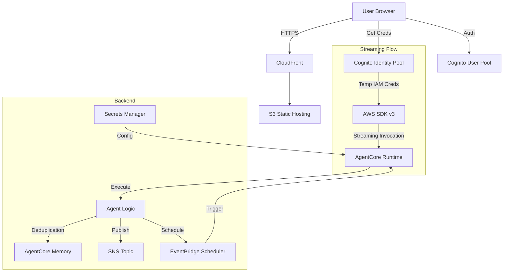

# AWS Newsletter Agent

A fully autonomous AI agent built with AWS Bedrock AgentCore and Strands that generates and delivers daily email newsletters about AWS AI/ML announcements.

## Overview

This agent:
- **Fetches** AWS news from https://aws.amazon.com/new/
- **Filters** for AI/ML-related content (or broader coverage on request)
- **Deduplicates** using AgentCore semantic memory
- **Formats** professional ASCII-bordered newsletters with numbered announcements
- **Delivers** via Amazon SNS email subscriptions
- **Chats** via secure, authenticated Web UI
- **Configures Itself** using AWS Secrets Manager and AgentCore discovery

## Architecture



## Deployment

### 1. Deploy Infrastructure
First, deploy the backend resources (SNS, IAM Roles, Memory, Secrets) using CDK.

```bash
cd ../backend
cdk deploy --context email=your-email@example.com
```

### 2. Configure Secrets
Push configuration to AWS Secrets Manager and generate local deployment config.

```bash
cd ../backend
python configure_secret.py --email your-email@example.com
```

**This creates:**
1. **Secrets Manager entry** (`aws-newsletter/agent-config`) - Runtime config for the agent
2. **Local file** (`agent/agent_config.env`) - Deployment config with role ARN for `agentcore configure`

### 3. Deploy Agent
Deploy the agent to AgentCore Runtime.

```bash
cd ../agent

# Configure agent using values from agent_config.env
# Option A: Use explicit values (copy from agent_config.env)
agentcore configure -e agent.py \
  --region us-west-2 \
  --name aws_newsletter_bot \
  --execution-role arn:aws:iam::ACCOUNT:role/aws-newsletter-agentcore-runtime-role

# Option B: Source the env file and use variables
source agent_config.env
agentcore configure -e agent.py \
  --region $AWS_REGION \
  --name $AGENT_NAME \
  --execution-role $AGENTCORE_RUNTIME_ROLE_ARN

# Launch to AWS with SECRET_NAME environment variable
agentcore launch --env SECRET_NAME=$SECRET_NAME --env AWS_REGION=$AWS_REGION
```

**Note:** The `agentcore configure` command requires `--name` and `--execution-role` parameters. Get these values from the `agent_config.env` file created in step 2.

#### Interactive Prompts During agentcore configure

During `agentcore configure`, you'll be prompted to select:

| Prompt | Recommended Selection |
|--------|----------------------|
| Dependency file | Press Enter to use `requirements.txt` |
| Deployment type | `1` - Direct Code Deploy (recommended) |
| Python runtime | `4` - PYTHON_3_13 |
| S3 bucket | Press Enter to auto-create |
| OAuth authorizer | `no` (use IAM) |
| Request header allowlist | `no` (use defaults) |
| Memory configuration | Select existing memory (e.g., `1`) |

### 4. Autonomous Self-Scheduling (The "Magic" Step)
Ask the agent to set up its own schedule.

1. Send the command via Chat or CLI:
   > "Setup your daily schedule for 8 AM."
   
2. The agent will:
   - Autonomously discover its own Agent ID (`find_agent_id`)
   - Create the EventBridge schedule (`manage_eventbridge_schedule`)
   - Confirm the schedule is active

## Configuration

The agent uses a **two-tier configuration pattern**:

### 1. Runtime Configuration (Secrets Manager)
The agent loads its configuration from AWS Secrets Manager at startup via `secrets_loader.py`.

**Variables stored in Secrets Manager:**
- `AWS_REGION`: AWS region for all services
- `SNS_TOPIC_ARN`: For email delivery
- `BEDROCK_AGENTCORE_MEMORY_ID`: For deduplication
- `AGENT_NAME`: For self-discovery
- `AGENT_ACTOR_ID`: Actor identifier for memory
- `AGENT_SESSION_ID`: Session ID for memory persistence (remembering name, preferences)
- `NEWSLETTER_EMAIL`: Default recipient
- `AGENTCORE_RUNTIME_ROLE_ARN`: IAM role for agent execution
- `SCHEDULER_ROLE_ARN`: IAM role for EventBridge scheduling

### 2. Deployment Configuration (Local File)
The `agent_config.env` file contains minimal config needed for the `agentcore configure` command:

```env
AGENTCORE_RUNTIME_ROLE_ARN=arn:aws:iam::ACCOUNT:role/aws-newsletter-agentcore-runtime-role
AWS_REGION=us-west-2
AGENT_NAME=aws_newsletter_bot
```

**To update configuration:** Re-run `backend/configure_secret.py` with new parameters. This updates both Secrets Manager and regenerates `agent_config.env`.

## Agent Capabilities

### Tools
- **http_request** (Strands built-in) - Fetches AWS news feed
- **current_time** (Strands built-in) - Gets current date
- **publish_message** (custom) - Sends emails via SNS
- **manage_eventbridge_schedule** (custom) - Creates/Updates execution schedules
- **find_agent_id** (custom) - Self-discovery tool for agent identity

### Self-Discovery Pattern
This agent implements a "Self-Aware" pattern to solve infrastructure circular dependencies:
1. Agent needs its own ARN to create a schedule.
2. ARN doesn't exist until after deployment.
3. **Solution**: Agent uses `find_agent_id` tool at runtime to look up "aws_newsletter_bot" and retrieve its own ARN dynamically.
4. **Benefit**: Zero manual configuration or post-deployment env var updates required.

### Streaming & Direct Invocation
The agent supports **Streaming Responses** via AWS SDK v3 (`bedrock-agentcore:InvokeAgentRuntime`). This architecture:
1. **Bypasses API Gateway Timeouts**: Allows for long-running generations by keeping the stream open.
2. **Secures Access**: The browser uses temporary IAM credentials from Cognito Identity Pool to sign requests directly.
3. **Real-Time UI**: The chat interface updates in real-time as the agent "thinks" and generates tokens.

## File Structure

```
agent/
├── agent.py                    # Main agent code (production)
├── secrets_loader.py           # Helper to load config from Secrets Manager
├── README.md                   # This file
├── requirements.txt            # Python dependencies
├── tools/                      # Custom tools (auto-loaded)
│   ├── aws_news_tools.py       # AWS news fetching tools
│   ├── create_events.py        # EventBridge scheduling tools
│   └── sns_tools.py            # SNS publish/subscribe tools
└── .bedrock_agentcore/         # AgentCore deployment config
```

## Troubleshooting

### Agent Not Creating Memory Records
**Symptom**: Day 2 doesn't skip duplicates from Day 1

**Causes**:
1. Agent not mentioning article URLs in response
2. Semantic extraction prompt not configured in CDK
3. Memory provisioning incomplete (wait 5min after CDK deploy)

### Email Not Received
**Symptom**: Agent runs successfully but no email arrives

**Causes**:
1. SNS subscription not confirmed (check email for confirmation link)
2. Secrets Manager not configured (run `configure_secret.py`)
3. IAM role lacks SNS publish permissions

**Fix**:
```bash
# Check logs for "Configuration Loaded" message
aws logs tail /aws/bedrock-agentcore/runtimes/ --follow
```

## License

© 2025 Amazon Web Services, Inc.
