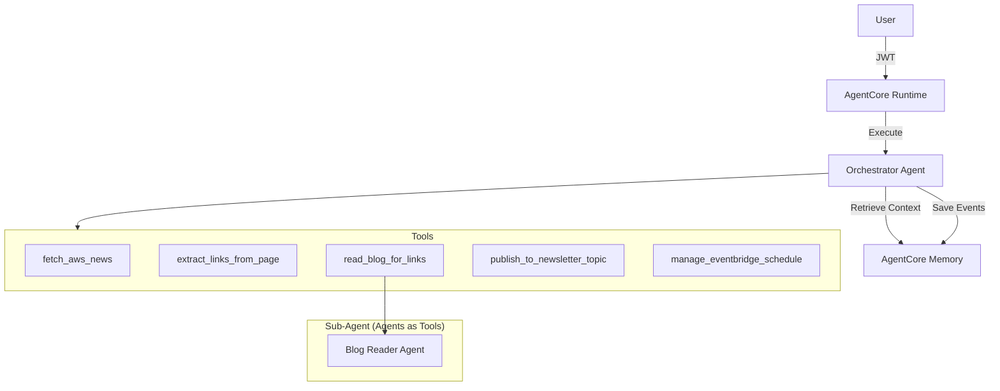

# AWS Newsletter Agent

Strands agent that generates AWS newsletters focused on Agentic AI and AI/ML announcements. Uses a **multi-agent architecture** with an orchestrator agent and a specialized sub-agent for enhanced link extraction.

## Features

- 🎯 **Agentic AI Focus** - Prioritizes AgentCore, Strands, MCP, Kiro, A2A, Claude
- 🤖 **Multi-Agent Architecture** - Orchestrator + sub-agent for link extraction
- 📰 **Browse vs Publish** - View news or send newsletters on demand
- 🔗 **Enhanced Links** - Extracts documentation and GitHub links from announcements
- 🧠 **Per-User Memory** - Remembers name, preferences, newsletter history
- 🔄 **Self-Scheduling** - Discovers own ARN and creates EventBridge schedules
- 📧 **Email Delivery** - Professional newsletters via SNS

## Architecture

```
┌─────────────────────────────────────────────────────────────┐
│                    ORCHESTRATOR AGENT                        │
│                   (agent.py - Sonnet)                        │
│                                                              │
│  Workflow: Fetch → Filter → Enhance → Format → Publish      │
└──────────────────────────┬──────────────────────────────────┘
                           │
         ┌─────────────────┼─────────────────────────┐
         ▼                 ▼                         ▼
   ┌───────────┐    ┌───────────────┐    ┌─────────────────┐
   │fetch_aws_ │    │extract_links_ │    │read_blog_for_   │
   │   news    │    │  from_page    │    │     links       │
   └───────────┘    └───────────────┘    └────────┬────────┘
      Tool              Tool                      │
   (RSS feed)     (Regex extraction)              ▼
                                          ┌──────────────┐
                                          │  SUB-AGENT   │
                                          │  (Sonnet)    │
                                          └──────────────┘
                                          Blog analysis
```

The orchestrator agent calls tools to fetch news and extract links. For blog posts, it uses a **sub-agent** (wrapped as a tool) that intelligently analyzes blog content to find documentation and GitHub links.



## Usage Modes

### Browse Mode
```
User: "What's new in AWS today?"
Agent: Shows summary, asks if you want to publish
```

### Publish Mode
```
User: "Send me a newsletter"
Agent: Generates, sends email, confirms with timestamp
       "Newsletter sent on November 27, 2025 at 1:15 PM EST"
```

### Memory Recall
```
User: "What's the most recent newsletter you sent me?"
Agent: Recalls date, subject, and content summary
```

## Deployment

```bash
# Source config
source agent_config.env

# Configure
agentcore configure -e agent.py \
  --region $AWS_REGION \
  --name $AGENT_NAME \
  --execution-role $AGENTCORE_RUNTIME_ROLE_ARN

# Deploy
agentcore launch --env SECRET_NAME=$SECRET_NAME --env AWS_REGION=$AWS_REGION
```

## Memory Integration

The agent uses `LongTermMemoryHookProvider` (in `memory_hooks.py`) for persistent memory:

| Event | Action |
|-------|--------|
| `MessageAddedEvent` | Retrieves relevant context from memory |
| `AfterInvocationEvent` | Saves conversation to memory |

### Memory Namespaces

| Namespace | Purpose |
|-----------|---------|
| `/newsletter/articles/{userId}` | Article URLs for deduplication |
| `/newsletter/preferences/{userId}` | User preferences and history |

### Per-User Isolation

JWT `sub` claim from Cognito becomes the `actor_id`, ensuring each user has isolated memory.

## Tools

| Tool | Type | Purpose |
|------|------|---------|
| `fetch_aws_news` | Tool | Fetches AWS What's New RSS feed |
| `extract_links_from_page` | Tool | Regex-based extraction of docs/GitHub links |
| `read_blog_for_links` | Sub-Agent | AI-powered blog analysis for deep link extraction |
| `publish_to_newsletter_topic` | Tool | Sends email via SNS |
| `manage_eventbridge_schedule` | Tool | Creates/updates schedules |
| `find_agent_id` | Tool | Self-discovery for scheduling |
| `current_time` | Tool | Gets current date/time |

### Multi-Agent Pattern

The `read_blog_for_links` tool demonstrates the **"Agents as Tools"** pattern:

```python
# Sub-agent created once, reused for each blog
blog_reader_agent = Agent(
    system_prompt=BLOG_READER_PROMPT,
)

@tool
def read_blog_for_links(url: str) -> str:
    """Uses a sub-agent to extract links from blog posts."""
    html = fetch_page_content(url)
    result = blog_reader_agent(f"Extract links from: {html}")
    return str(result)
```

**How the multi-agent pattern works:**

1. **Browse Mode**: Quick summary only - no link extraction (fast, cheap)
2. **Publish Mode**: Full enhancement workflow:
   - `extract_links_from_page` finds docs/GitHub/blog links using regex
   - If blog posts or github.io pages are found, orchestrator calls `read_blog_for_links`
   - Sub-agent extracts additional links that regex missed (e.g., GitHub repos in blog text)

This creates observable traces showing the orchestrator calling the sub-agent only when publishing.

## Configuration

Loaded from Secrets Manager at runtime via `secrets_loader.py`:

| Variable | Purpose |
|----------|---------|
| `SNS_TOPIC_ARN` | Email delivery |
| `BEDROCK_AGENTCORE_MEMORY_ID` | Memory store |
| `AGENT_NAME` | Self-discovery |
| `SCHEDULER_ROLE_ARN` | EventBridge permissions |

## Files

```
agent/
├── agent.py              # Orchestrator agent with system prompt
├── memory_hooks.py       # Long-term memory integration
├── secrets_loader.py     # Secrets Manager loader
├── requirements.txt      # Dependencies
└── tools/
    ├── aws_news_tools.py   # RSS fetching
    ├── link_extractor.py   # Regex-based link extraction (no LLM)
    ├── blog_reader.py      # Sub-agent for blog analysis
    ├── sns_tools.py        # Email publishing
    └── create_events.py    # Scheduling + self-discovery
```

## Troubleshooting

### Memory Not Saving
- Check CloudWatch logs for "Successfully saved event to memory"
- Ensure JWT has valid `sub` claim
- Wait a few minutes for memory extraction

### Newsletter Not Received
- Confirm SNS subscription (check email)
- Verify `SNS_TOPIC_ARN` in Secrets Manager
- Check agent has `sns:Publish` permission

### View Logs
```bash
aws logs tail /aws/bedrock-agentcore/runtimes/ --follow
```
