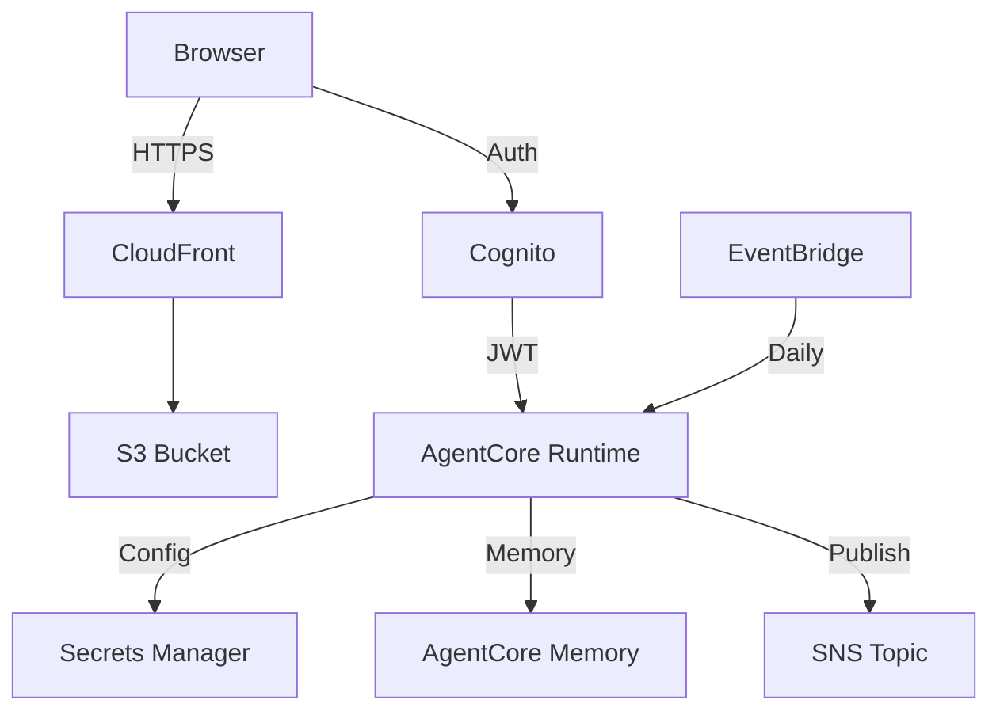

# Backend Infrastructure

CDK infrastructure for the AWS Newsletter system.

## Components

| Resource | Purpose |
|----------|---------|
| **SNS Topic** | Email distribution |
| **AgentCore Memory** | Article dedup + user preferences (30-day TTL) |
| **Secrets Manager** | Agent configuration |
| **Cognito User Pool** | User authentication |
| **Cognito Identity Pool** | AWS credentials for authenticated users |
| **S3 Bucket** | Frontend hosting |
| **CloudFront** | HTTPS distribution |
| **IAM Roles** | Agent runtime + EventBridge scheduler |

## Architecture



## Quick Start

```bash
# Install CDK
npm install -g aws-cdk

# Install dependencies
pip install -r requirements.txt

# Bootstrap (first time only)
cdk bootstrap

# Deploy
cdk deploy --context email=your-email@example.com

# Configure secrets
python configure_secret.py --email your-email@example.com

# Deploy frontend
python deploy_frontend.py
```

## Memory Configuration

Two memory strategies configured:

| Strategy | Namespace | Purpose |
|----------|-----------|---------|
| Semantic | `/newsletter/articles` | Article URL deduplication |
| User Preference | `/newsletter/preferences` | User name, preferences, history |

## Scripts

### configure_secret.py
Updates Secrets Manager and generates `agent/agent_config.env`:
```bash
python configure_secret.py --email your-email@example.com
```

### deploy_frontend.py
Uploads frontend to S3 and invalidates CloudFront:
```bash
python deploy_frontend.py
```

## Stack Outputs

| Output | Description |
|--------|-------------|
| `NewsletterTopicArn` | SNS topic for email |
| `MemoryId` | AgentCore memory ID |
| `AgentConfigSecretName` | Secrets Manager name |
| `AgentCoreRuntimeRoleArn` | IAM role for agent |
| `CloudFrontUrl` | Frontend URL |
| `UserPoolId` | Cognito user pool |
| `IdentityPoolId` | Cognito identity pool |

## Commands

```bash
# Preview changes
cdk diff

# Deploy with custom name
cdk deploy --context stack_name=my-newsletter

# Destroy
cdk destroy
```

## Files

```
backend/
├── app.py                  # CDK entry point
├── newsletter_stack.py     # Stack definition
├── configure_secret.py     # Secrets setup
├── deploy_frontend.py      # Frontend deployment
└── requirements.txt        # Dependencies
```
