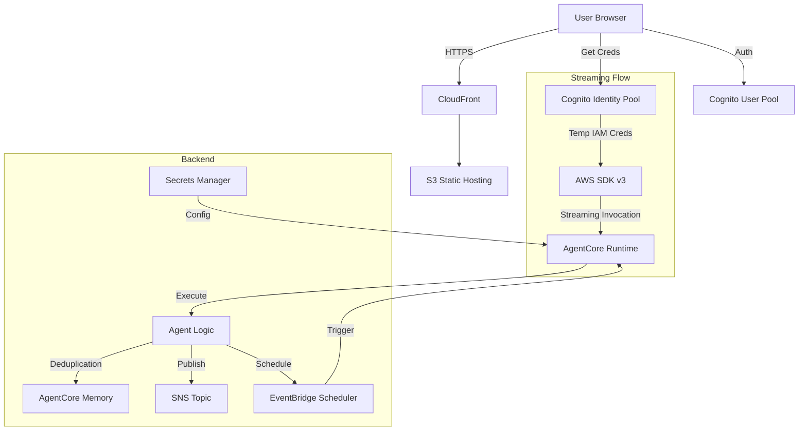

# AWS Newsletter Backend Infrastructure

CDK-based infrastructure for the AWS What's New Alerts newsletter system. Deploys SNS for email delivery, AgentCore Memory for article deduplication, Secrets Manager for configuration, and optional EventBridge Scheduler.

## Architecture



## Features

- 📧 **Email Newsletter Distribution** via SNS
- 🧠 **Article Deduplication** via AgentCore Memory (30-day retention)
- 🔒 **Secure Configuration** via AWS Secrets Manager
- 💬 **Secure Chat UI** with Cognito Auth, S3 Hosting, and CloudFront
- 🛡️ **Direct Streaming** - Secure, low-latency connection using AWS SDK v3 (No API Gateway/Lambda Proxy needed)
- ⚡ **Real-Time Responses** - Immediate token streaming via AgentCore Runtime
- 🤖 **Autonomous Operation** via EventBridge Scheduler
- 🔐 **IAM Security** with least privilege roles
- 🚀 **Infrastructure as Code** with AWS CDK

## Infrastructure Components

### Core Resources
1. **SNS Topic** - Email distribution to subscribers
2. **AgentCore Memory** - Semantic + user preference strategies
3. **Secrets Manager Secret** - Stores agent configuration (ARNs, IDs)
4. **AgentCore Runtime Role** - IAM role for agent execution

### Frontend Resources
5. **Cognito User Pool** - User management (Sign up/in)
6. **Cognito Identity Pool** - AWS credentials for authenticated users
7. **S3 Bucket** - Static website hosting
8. **CloudFront** - HTTPS content delivery

### Optional Resources
9. **EventBridge Scheduler Role** - IAM role allowing the Agent to create/manage its own schedule (Autonomous Scheduling)
10. **EventBridge Scheduler DLQ** - Dead Letter Queue for failed schedule invocations

## Quick Start

### Prerequisites

```bash
# Install Node.js (for CDK CLI)
# https://nodejs.org/

# Install CDK CLI globally
npm install -g aws-cdk

# Install Python dependencies
pip install -r requirements.txt

# Configure AWS CLI
aws configure
```

### Initial Deployment

```bash
# 1. Bootstrap CDK (first time only per account/region)
cdk bootstrap

# 2. Deploy infrastructure (Backend + Frontend)
cdk deploy --context email=your-email@example.com

# 3. Configure Agent Secrets & CLI Environment
#    - Updates AWS Secrets Manager (for runtime)
#    - Creates local ../agent/agent_config.env (for deployment CLI)
python configure_secret.py --region us-west-2 --email your-email@example.com

# 4. Deploy Frontend Code
#    - Generates config.js from stack outputs
#    - Uploads frontend/index.html to S3
python deploy_frontend.py

# 5. Wait 2-5 minutes for AgentCore Memory provisioning

# 6. Check email and confirm SNS subscription
```

### Deploy Agent

After infrastructure is deployed:

```bash
# 6. Navigate to agent directory
cd ../agent

# 7. Configure and deploy agent
agentcore configure -e agent.py --region us-west-2
agentcore launch

# 8. Autonomous Self-Scheduling
# Ask the agent to schedule itself via Chat UI or CLI
# "Setup your daily schedule for 8 AM."
```

## CDK Commands

### Development

```bash
# View changes before deploying
cdk diff

# Deploy with custom parameters
cdk deploy --context stack_name=my-newsletter \
           --context region=us-west-2 \
           --context email=your-email@example.com

# List all stacks
cdk list
```

### Secret Management

The `configure_secret.py` script handles configuration updates without needing to redeploy code.

```bash
# Update configuration (e.g. change email)
python configure_secret.py --email new-email@example.com

# View stack outputs
aws cloudformation describe-stacks --stack-name aws-newsletter-prod \
    --query 'Stacks[0].Outputs' --output table
```

## File Structure

```
backend/
├── app.py                  # CDK app entry point
├── newsletter_stack.py     # Complete stack definition
├── configure_secret.py     # Updates Secrets Manager
├── deploy_frontend.py      # Deploys Frontend to S3
├── cdk.json                # CDK configuration
├── requirements.txt        # Python dependencies
└── README.md               # This file
```

## Configuration

### Context Variables

Pass configuration via CDK context (command line or `cdk.json`):

| Variable | Required | Default | Description |
|----------|----------|---------|-------------|
| `email` | No | None | Email to subscribe to newsletter |
| `stack_name` | No | `aws-newsletter` | Stack name prefix |
| `region` | No | `us-west-2` | AWS region |
| `enable_scheduler` | No | `false` | Enable *Static* EventBridge Scheduler (Legacy) |

## Stack Outputs

- `NewsletterTopicArn` - SNS topic ARN for email distribution
- `MemoryId` - AgentCore Memory ID for agent configuration
- `AgentConfigSecretName` - Name of the Secret storing configuration
- `AgentCoreRuntimeRoleArn` - IAM role for agent runtime
- `CloudFrontUrl` - URL for the Chat UI
- `UserPoolId` / `IdentityPoolId` - Cognito Auth IDs

## IAM Roles

### AgentCore Runtime Role
Allows agent to:
- `sns:Publish` to newsletter topic
- `secretsmanager:GetSecretValue` for configuration
- `logs:CreateLogGroup` etc. for logging

### EventBridge Role (if scheduler enabled)
Allows EventBridge Scheduler to:
- `bedrock-agentcore:InvokeAgentRuntime` on agent ARN

## Clean Up

```bash
# Destroy all infrastructure
cdk destroy

# Secret deletion is usually immediate, but may have a recovery window
```
